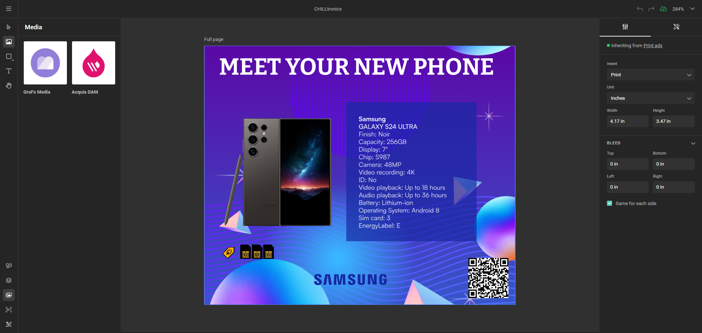
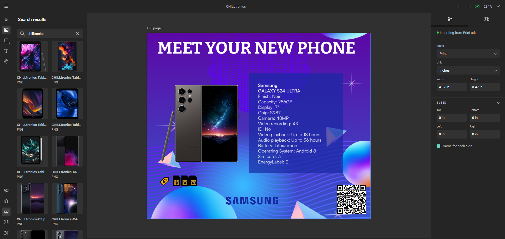
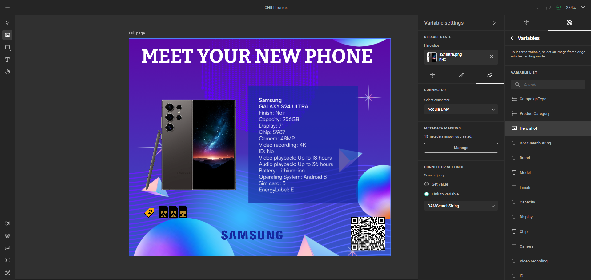
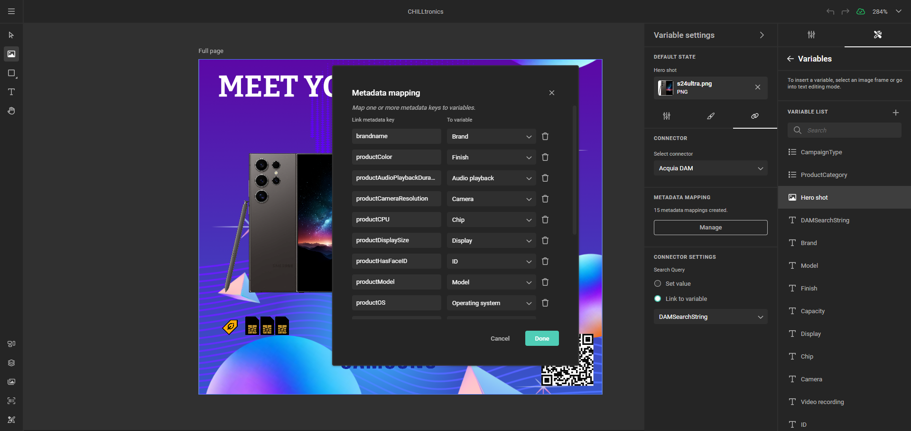

# Media Connectors

A **Media Connector** accelerates collateral creation by bringing assets from an external media repository in GraFx Studio.

The value value for end-users is having access to brand managed assets (with the corresponding metadata) while respecting the digital rights management of the external system.
Media Connector also enable fully automated content creation to drive content creation at scale.

Connectors can be used in **self-service** or **headless solutions**.

## Self Service

Imagine a local marketeer who needs to create marketing collateral with assets from the corporate DAM system (self service).

## Headless or automated

Imagine a process that runs in the background, creating collateral in an automated way, with access to the corporate DAM system.

## Concepts

If you're thinking about building your own Media Connector, these are a approaches you can consider.

## Concept 1: Making assets available for the end-user

In the panel ‘Media’ on the left in GraFx Studio a Template Designer can browse between the available Media Connectors. Multiple media repositories can be connected and by default the built-in application GraFx Media is available.

When the Template Designers clicks on a Media Connector the repository is opened and all the assets the user is entitled to have access too, according to the digital rights governance within the Media Connector, are shown.

The Template Designer can select and add an asset to the design. 

**Challenge**: In the above scenario, the user will see **all** the assets.

### Narrowing down the selection

In the Template Designer Workspace a template designer can configure which specific assets are made available for the end-user in the EU Interface. This is to avoid that an end-user would see all the assets, even the assets that are less relevant. 

**Solution**: Refine the query to limit assets view

E.g. Assets will be shown to the end-user depending on a chosen category. (electronics, household, food, ...)

This is configured by a **search string** in the Connector Settings. 

A Media Connector communicates to a media provider (eg DAM). Each of these providers will have different query configurations. E.g. In DAM systems, that would be a query.

In the end-user interface the end-user will see the selection of assets. In this example a category of smartphones:

## Concept 2: Making assets available and exposing metadata

In this example, we’ve included product information to highlight how seamlessly a DAM system can complement detailed product data, showcasing the potential of a fully integrated approach.

The metadata of an asset can be configured as variables in the Template Designer Workspace and injected into the template. When the end-user changes the assets in the End User Interface the metadata is updated accordingly.

Leveraging the full Composition Model, you can then define an action to be triggered according to the value of the metadata, and execute actions on your document.

## Support

CHILI publish categorizes CHILI GraFx Connectors into four categories.

### Built-in

GraFx Studio connects to GraFx Media through the GraFx Media connector, utilizing the same framework as other media connectors. CHILI publish assumes full responsibility for the development and support of the GraFx Media connector and the associated media service, as all elements were built in-house.

### Built by CHILI publish

To facilitate connections to external services, CHILI publish develops Media Connectors for specific applications. For instance, the Media Connector for Acquia DAM is built and supported by CHILI publish. Support for these connectors encompasses their internal workings, including API calls made to external systems. However, issues related to availability, configuration, or API problems on the media provider's side are not covered under support. Our Customer Support team assists in identifying the origin of such issues.

**Example**: The Media Connector for Acquia DAM

### Built by Third Party, Approved by CHILI publish

Our open connector framework encourages developers to [build connectors](/GraFx-Developers/connectors/build-media-connector/) for their unique use cases. If a media provider develops a connector, such as for a generative AI application, it can be offered in our marketplace. Support for these connectors is provided by the developer.

### Custom (Private) Connectors

In cases where a built-in or readily available connector is unavailable for specific needs, we encourage you to [build custom connectors](/GraFx-Developers/connectors/build-media-connector/). These connectors can be tailored for private use or offered in the marketplace for broader application. Building a private connector allows integration with custom media providers and customization to meet specific requirements.

## Metadata Mapping

When an asset is fetched from the DAM, metadata is sent alongside.
This medadata can be mapped to variables.